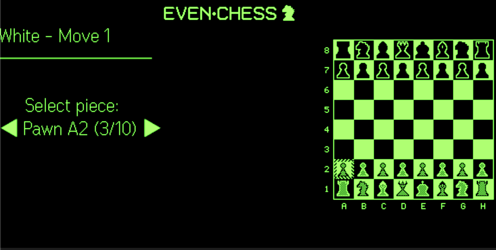
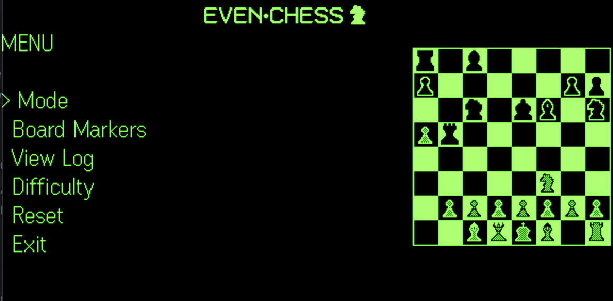
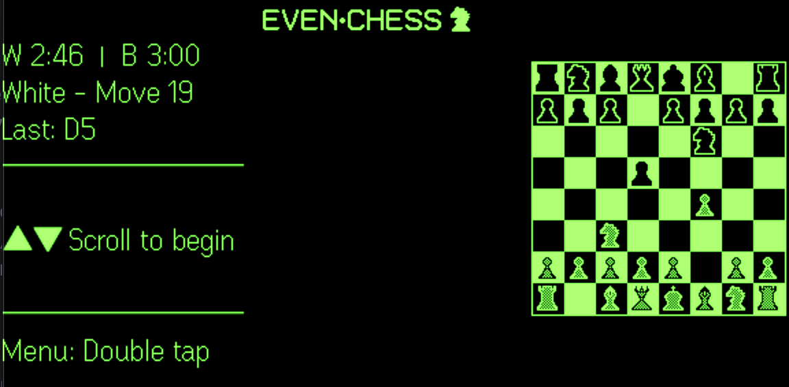
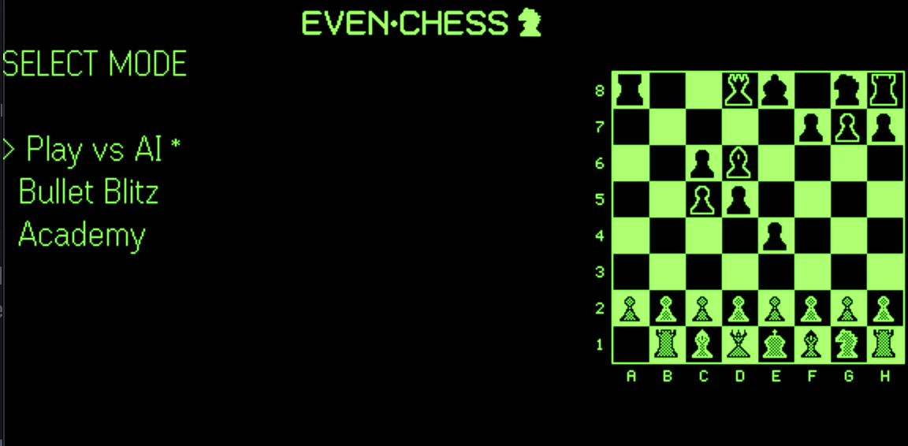
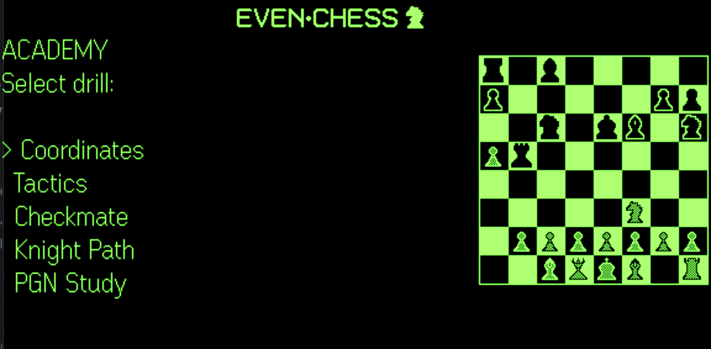

# EvenChess

Chess for **Even Realities G2** smart glasses: play vs Stockfish, race the clock in Bullet Blitz, or train in the Academy. Use the ring controller (R1) or touchpad — scroll to move, tap to select.

This project is licensed under the MIT License — see [LICENSE](LICENSE).

## Screenshots

| Play — piece selection | Menu | Academy — drill selection |
|------------------------|------|-------------|
|  |  |  |

| Bullet Blitz — timed game | Mode select |
|---------------------------|----------------------------|
|  |  |

## Quick links

- **In-app help:** Open the app on your phone to see the full instructions (getting started, modes, controls, academy). Same content as [index.html](index.html) in this repo.

## Tech stack

- **Runtime:** TypeScript, Vite
- **Chess:** [chess.js](https://github.com/jhlywa/chess.js) (rules, FEN, moves). [Stockfish](https://stockfishchess.org/) via **stockfish.js** (worker + WASM copied to `public/stockfish/` on install). If the engine doesn’t load, the app falls back to random moves.
- **Glasses:** [Even Hub SDK](https://www.npmjs.com/package/@evenrealities/even_hub_sdk) — containers, 1-bit BMP updates, event mapping
- **Tests:** Vitest

## Project structure

```
EvenChess/
├── index.html          # Entry page; shows help/instructions on phone, mounts app in #app
├── src/
│   ├── main.ts         # Boots the app
│   ├── app.ts          # Wires ChessService, store, composer, EvenHub bridge, TurnLoop, persistence
│   ├── state/          # Redux-like state: contracts, reducer, selectors, store, constants, utils
│   ├── render/         # Board (boardimage), branding, composer (SDK containers), BMP helpers, pieces
│   ├── evenhub/        # SDK bridge: init, page setup, text/image updates, event subscription
│   ├── chess/          # ChessService (chess.js wrapper), square-utils
│   ├── engine/         # TurnLoop, StockfishBridge (worker), profiles
│   ├── bullet/         # Clock (tick, increment, format, expiry)
│   ├── academy/        # Drills (coordinates, knight path, tactics, mate, PGN), puzzles, knight logic
│   ├── storage/        # Persistence (game save, difficulty, board markers)
│   └── input/          # SDK event → Action mapping (scroll/tap/double-tap), replay fixtures
└── tests/              # Unit tests for state, storage, bullet, academy, chess, input
```

## Prerequisites

- **Even Realities** — G2 glasses and the [Even App](https://www.evenrealities.com/) (so you can open the widget and see the chess HUD on your glasses).
- **Node.js** — v20.19.0 or newer. [Download Node.js](https://nodejs.org/) if you don’t have it; the installer is enough.

## Setup

1. **Clone and install**
   - Open a terminal (Command Prompt, PowerShell, or Terminal app).
   - Clone the repo (use the project’s clone URL from GitHub, or your fork):
     ```bash
     git clone https://github.com/owner/EvenChess.git
     cd EvenChess
     ```
   - Install dependencies:
     ```bash
     npm install
     ```

2. **Run locally**
   ```bash
   npm run dev
   ```
   - You’ll see a local URL (e.g. `http://localhost:5173`). Keep this terminal open while you use the app.

3. **Open in the Even App**
   - **Option A:** Run `npx evenhub qr` in the project folder, then scan the QR code with the Even App to open the widget on your glasses.
   - **Option B:** Open the dev URL (e.g. `http://<your-computer-ip>:5173`) in the Even App’s in-app browser so the chess app appears on your G2 glasses.

4. **Try it**
   - On your **phone:** Open the same URL in a browser to see the [help page](index.html) (getting started, modes, controls).
   - On your **glasses:** Scroll to move the cursor, tap to select; double-tap from idle to open the menu (Mode, Difficulty, Academy, etc.).

## Usage on the glasses

- **Scroll** — Move the selection on the board or in menus.
- **Tap** — Select a square, confirm a move, or choose a menu item.
- **Double-tap (from idle)** — Open the menu: Mode, Board Markers, View Log, Difficulty, Reset, Exit.

## Scripts

| Command        | Description                |
|----------------|----------------------------|
| `npm run dev`  | Start dev server           |
| `npm run build`| Build for production       |
| `npm run preview` | Preview production build |
| `npm run test` | Run tests once             |
| `npm run test:watch` | Run tests in watch mode |
| `npm run lint` | Lint `src/`                |

## Build and deploy

```bash
npm run build
```

Output is in `dist/`. Deploy that folder to any static host, then open the deployed URL in the Even App to use the widget in production.

## Features (summary)

- **Play vs AI:** White vs Stockfish; Easy, Casual, or Serious difficulty. Game auto-saves.
- **Bullet Blitz:** Timed game with optional increment (e.g. 1+0, 3+2, 5+5).
- **Academy:** Coordinate drill, Tactics, Mate-in-one, Knight Path, PGN Study (famous games and openings).
- **Menu (double-tap from idle):** Mode, Board Markers (A–H / 1–8), View Log, Difficulty, Reset, Exit. Difficulty and board markers are saved.

Full behavior and tips are on the in-app help page ([index.html](index.html)).

## License & credits

- **chess.js** — [BSD-2-Clause](https://opensource.org/licenses/BSD-2-Clause). Copyright © Jeff Hlywa. Used for move generation, validation, FEN, and PGN. [GitHub](https://github.com/jhlywa/chess.js).
- **Stockfish** — The app uses [stockfish.js](https://www.npmjs.com/package/stockfish.js) (GPL-3.0); worker and WASM are copied to `public/stockfish/` on install. If the engine doesn’t load (e.g. missing files), the app falls back to random moves. The MIT license above applies only to EvenChess; any build that includes Stockfish must comply with GPL-3.0 for that component (attribution, license text, source offer).
